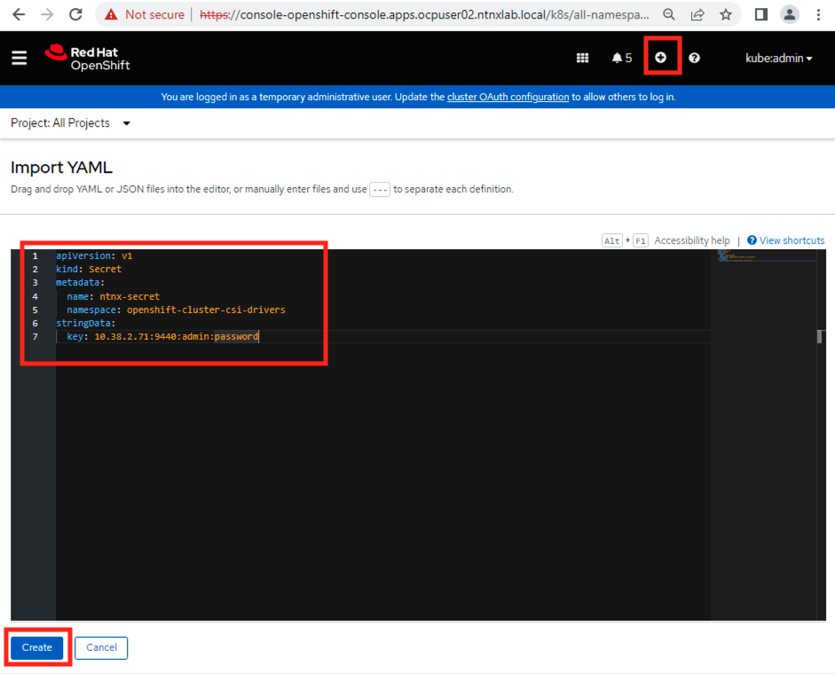

import Tabs from '@theme/Tabs';
import TabItem from '@theme/TabItem';

:::danger

Do not execute any commands in this section. Doing so will produce unintended results.

Do not perform any steps in this section.

This section is for informational purpose only. 

:::

Before you proceed to the workload section of this lab, it is important for you know that there are two ways to interact with OCP cluster. 

1. `OC` command line and
2. `Import YAML` functionality in the Openshift Web UI 

You are free to choose whichever you like. 

## OC command line

We have only documented oc command line in this lab guide 

You export kubeconfig file to the environment of your LinuxTools VM file and run ``oc`` commands

Find an example command below:

```mdx-code-block
<Tabs>
<TabItem value="Creating a manifest, edit and apply through oc command">
```
``` bash title="Create a template manifest file"
cat << EOF > csi_secret.yaml
apiVersion: v1
kind: Secret
metadata:
  name: ntnx-secret
  namespace: openshift-cluster-csi-drivers
stringData:
  key: <Prism Element IP>:9440:<Prism Element UserName>:<Prism Element Password>    # << change this
  # example: 
  # key: 10.38.2.71:9440:admin:password
EOF
```
```bash title="Edit your manifest file with desired values"
vi csi_secret.yaml
```
```bash title="Apply your edited manifest file"
oc apply -f csi_secret.yaml
```
```mdx-code-block
</TabItem>
<TabItem value="Applying manifest directly through oc command">
``` 
``` bash title="Apply your pre-edited manifest file"
cat << EOF | oc apply -f - 
apiVersion: v1
kind: Secret
metadata:
  name: ntnx-secret
  namespace: openshift-cluster-csi-drivers
stringData:
  key: 10.38.2.71:9440:admin:password
EOF
```
```mdx-code-block
</TabItem>
</Tabs>
```

## Import YAML Line Functionality

1. To access this functionality, logon to your OCP cluster web UI

   ```url
   https://console-openshift-console.apps.ocpuserXX.ntnxlab.local/k8s/all-namespaces/import
   ```

2. Login as kubeadmin or a IDP user
   
3. Click on the ``+`` button on the top right-hand corner of the screen
4. Paste your template file
5. Edit contents of manifest directly in the editor on the Web UI
   
   

6. Click on **Create**

7. If the manifest is clean and void of syntax errors, you will get confirmation as shown below
   
   


