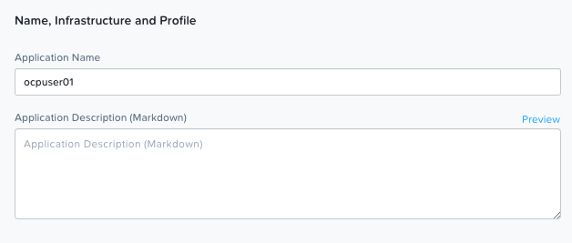
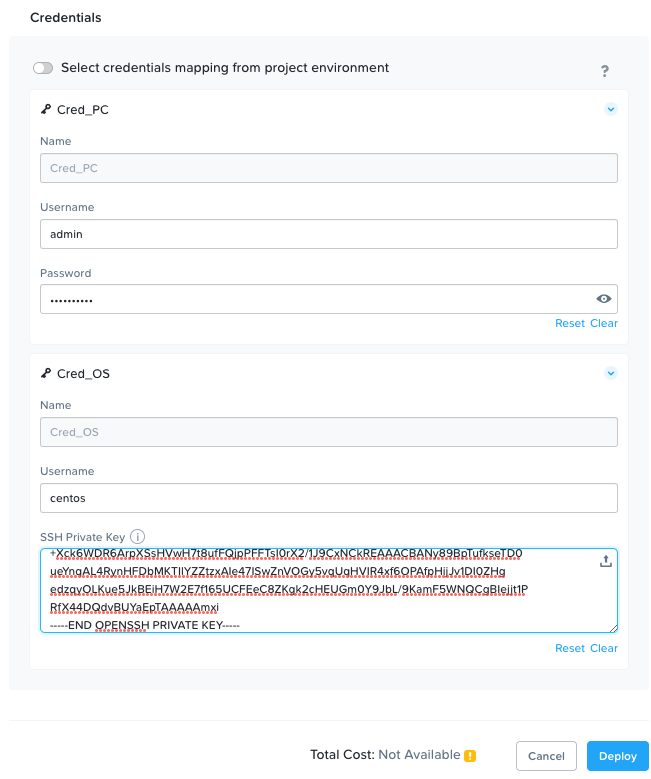
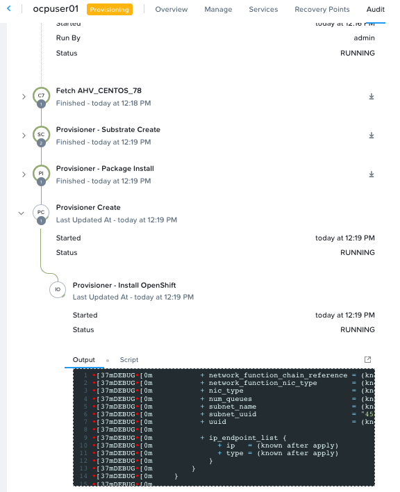

import Tabs from '@theme/Tabs';
import TabItem from '@theme/TabItem';


## OCP Marketplace Install Demo Video

Before beginning to install OCP cluster, watch the following ``5 minute`` overview video of OCP installation using Marketplace by Nutanix TME Nimal Kunnath. 

<iframe
    width="640"
    height="360"
    src="https://www.youtube.com/embed/G8fFB6EUiOA"
    frameborder="0"
    allow="autoplay; fs=1"
>
</iframe>

## Install OCP from Marketplace

In this section we will create our installation configuration files which will be then used in the next section to deploy an OCP cluster.

1. In PC dashboard, choose **Apps and Marketplace** from the top-left-hand-side drop-down menu

2. Search and select **OpenShift by Nutanix** app

   

3. Click on **Get**

4. Click on **Deploy**

5. Enter the following under **Name, Infrastructure and Profile section**: 
   
   - **Application Name** - ``ocpuserXX`` (this will the sub-domain's DNS entry you created in this [section](../ocp_pc_mp/ocp_pc_mp_pre_reqs.md#add-dns-records))
   
     
   
6. Enter the following under **Profile Variables**: 
   
   - **OpenShift version** - 4.12
   - **OpenShift cluster name** - ``ocpuserXX`` (this would be populated from the Application name)
   - **OpenShift base domain** - ``ntnxlab.local`` (this could be any domain you have access to)
   - **Prism Central FQDN** - ``pc.ntnxlab.local`` (this will be the FQDN/IP present in the Prism Central's SSL certificate)
   - **Prism Element IP** - ``x.x.x.x`` 
   - **OpenShift API VIP** - ``x.x.x.x``  (this will the API IP entry you reserved in this [section](../ocp_pc_mp/ocp_pc_mp_pre_reqs.md#ahv-networking))
   - **OpenShift Ingress VIP** - ``x.x.x.x``  (this will the Ingress IP entry you reserved in this [section](../ocp_pc_mp/ocp_pc_mp_pre_reqs.md#ahv-networking))
   - **OpenShift Machine Network** - ``x.x.x.x/x`` (this will your AHV network's CIDR)
  
     

7. Continue to enter the following under **Profile Variables**:
   
   - **OpenShift pod network** - ``10.128.0.0/14`` (leave default value)
   - **OpenShift pod addresses per host** - ``23`` (leave default value)
   - **OpenShift pod network** - ``10.128.0.0/14`` (leave default value)
   - **OpenShift service network** - ``172.30.0.0/16`` (leave default value)
   - **Control Plane CPU** - ``4``  (leave default - this will change based on customer`s requirements)
   - **Control Plane Memory** - ``16384``  (leave default - this will change based on customer`s requirements)
   - **Compute replicas** - ``4``  (leave default -this will change based on customer`s requirements)
   - **OpenShift pull secret** - copy from RedHat portal under the [Tokens](https://console.redhat.com/openshift/downloads) section
  
8. Enter the following under **Provisioner**: 
   
   - **Cluster** - leave blank
   - VM Name - leave default
   - Categories - leave default
   - NETWORK ADAPTERS (NICs) (1) - ``Primary``
   
     

8. Enter the following under **Credentials**: 
   
   - Cred_PC - this will be used to logon to Prism Central to create VMs and other entities
  
     - User name - ``admin``
     - Password - ``xxxxxx`` (your Prism Central password)
  
   - Cred_OS - this will be used to logon to OCP VMs once created
  
     - User name - ``centos``
     - SSH Private Key - ``xxxxxx`` (create a new SSH keypair or use one that you already have)
     
      ```mdx-code-block
      <details>
      <summary>No SSH-PUBLIC-KEY?</summary>
      <div>
      <body>

      :::tip 

      If you do not have a **SSH KEY**, use the ``ssh-keygen`` command on your **Linux Tools VM** to create a ssh key pair

      Remember to keep it safe somewhere. 

      ```bash
      cd ~/.ssh/
      ssh-keygen -t rsa -b 2048 -f ~/.ssh/for_ocp_nodes   # << accept all default answers
      ls -l
      ## Output here
      ~/.ssh/for_ocp_nodes.pub  
      ~/.ssh/for_ocp_nodes      # << use this private key
      ```

      </body>
      </div>
      </details>

      
  
9. Click on **Deploy** 
    
10. This will redirect to **My Apps** page. If not, click on **My Apps** > **OpenShift ocpuserXX** 

    

11. Click on **Manage** to see an overview of the OCP cluster deployment
    
12. Go to Audit tab to check the progress of your deployment
    
    

13. At the end of the installation (about 35 to 40 minutes), we can see the login details in the **Provisioner - Install OpenShift** task
    
    ```bash
   [37mDEBUG[0m OpenShift console route is admitted          
   [36mINFO[0m Install complete!                            
   [36mINFO[0m To access the cluster as the system:admin user when using 'oc', run 'export KUBECONFIG=/home/centos/openshift/auth/kubeconfig' 
   [36mINFO[0m Access the OpenShift web-console here: https://console-openshift-console.apps.ocpuser01.ntnxlab.local 
   [36mINFO[0m Login to the console with user: "kubeadmin", and password: "xxxx-xxxx-xxxx-xxxx" 
   [37mDEBUG[0m Time elapsed per stage:                      
   [37mDEBUG[0m            cluster: 1m32s                    
   [37mDEBUG[0m          bootstrap: 29s                      
   [37mDEBUG[0m Bootstrap Complete: 17m43s                   
   [37mDEBUG[0m                API: 1m38s                    
   [37mDEBUG[0m  Bootstrap Destroy: 20s                      
   [37mDEBUG[0m  Cluster Operators: 17m41s                   
   [36mINFO[0m Time elapsed: 37m51s 
    ```

    ```bash title="Openshift GUI Access"
    https://console-openshift-console.apps.ocpuser01.ntnxlab.local 
    ```
    ```bash title="Openshift API Access"
    https://api.ocpuser01.ntnxlab.local 
    ```

14. Note that the Nutanix CSI operator will also be automatically installed by the **Install Nutanix CSI Operator** task facilitating immediate deployment of workloads.
    
    

15. The OCP cluster is now ready to accessed

:::note

Now that you have finished OCP install, you can move on to the **OCP Command Access** section and then on to workloads section.

:::


## Cleanup (optional)

Run through the following if you would like to delete the OCP cluster. 

1. In Prism Central, go to **Apps and Marketplace**
2. Click on **My Apps** > **OpenShift ocpuserXX**  (the OCP cluster you deployed)
3. Click on the **Manage** tab
4. Click on **Delete** task
   
   
5. Click on **Delete** in the confirmation pop-up
6. Audit tab will have details of deletion

   

:::note 

The OCP provisioner VM can also be deleted upon successful creation or deletion of the OCP cluster. 

:::

Marketplace makes it easy and convenient to manage the lifecycle of your OCP clusters.s