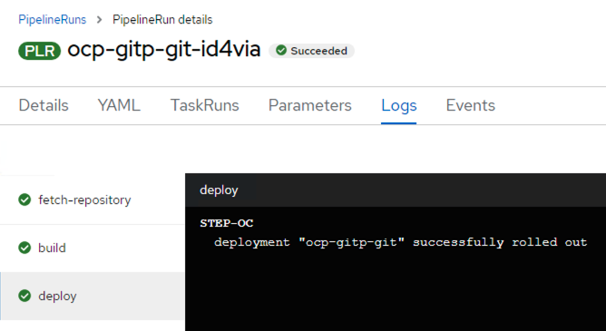

# OCP Serverless and CICD

In this lab we will delve into the world of Serverless and CICD with OCP. 

We will also see how Nutanix offers solutions that will facilitate serverless offerings with OCP.

Nutanix offers:

- HCI Compute and Storage
  - Objects as Container Registry location
    - This is where all the newly developed containers images are stored
  - OCP nodes runs as virtual machines on Nutanix 
    - Virtual machines needs volumes as storage
    - Virtual machines need compute and networking
    - Virtual machines can be deployed and destroyed with easy to use Nutanix APIs facilitating serverless 

In this lab, we will be deploy this OCP lab and exposing it internally as application.

In essence, this instruction website is a NodeJS application called [Docusaurus](https://docusaurus.io). 

OCP has Integrated Source to Image [S2I](https://github.com/openshift/source-to-image) capabilities natively and we will use this to demonstrate serverless functionality. 

- OCP S2I implementation decides on the best deployment strategy (dockerfile, pre-built container images, etc) without the developer having to worry about this 
- OCP will take care of the deployment part in the OCP (kubernetes)
- OCP will also create a route/ingress where the end-users can access the application

## High Level steps

1. Install Red Hat OpenShift Pipelines operator from OperatorHub
2. Use OCP's Import from Git functionality to get source code
3. Build a container 
4. Upload to OCP image registry
5. Deploy application to OCP cluster
6. Expose the application and access

## Install Red Hat OpenShift Pipelines operator

1. Browse to you OCP cluster's web UI

   ```url
   https://console-openshift-console.apps.ocpuserXX.ntnxlab.local/add/ns/dev
   ```
2. Login as kubeadmin or a IDP user
   
3. Search for ``piplelines`` keyword
   
4. Select ``Red Hat OpenShift Pipelines``
   
5. Click **Install**
   
   

6. Select latest release
   
7. Click **Install**
   
8. Monitor the installation to make sure it is installed without errors

## Create Projects and Access

Logon to your OC command line to create projects (namespaces) and necessary access for services accounts. 

Projects/namespaces are treated like different deployment environment (dev and stage). 

In the baremetal and virtual machine world, one would create different servers for these deployments. However, we will simulate this by creating different projects/namespaces in OCP cluster.

1. Logon to UserXX-LinuxToolsVM and connect to OCP cluster
   
   ```bash
   export KUBECONFIGKUBECONFIG=/path/to/kubeconfig
   ```

2. Create our dev and stage projects 
   
   ```bash
   oc create ns dev
   oc create ns stage
   ```
3. Grant ServiceAccount to projects
   
   ```bash
   oc adm policy add-role-to-group edit system:serviceaccounts -n dev
   ```
   ```bash
   oc adm policy add-role-to-group edit system:serviceaccounts -n stage
   ```
   ```bash
   oc adm policy add-role-to-user system:image-puller system:serviceaccounts:stage -n dev
   ```
   ```bash
   oc adm policy add-role-to-user system:deployer system:serviceaccounts:dev -n stage
   ```
## Deploying Application

1. Switch to Developer view
   
   

2. Click on **+Add** just under Developer
   
3. Make sure you are under `dev` project 
   
   

4. Click on **Import from Git**

5. Copy and paste the following url

   ```url
   https://github.com/nutanix-japan/ocp-gitp.git
   ```
6. Click on **Edit Import Strategy**
   
7. Choose the following options
    
   - **Import strategy** - Buider Ima-cluster1ge
   - **Buider Image** - NodeJS
   - **Buider Image version** - ``latest`` (ok for testing - not great for production)
   - **Add pipeline** - leave checked (click show pipeline visualization to see build steps)
   - **Target port** - ``3000``
   - **Create a route** - leave checked
   - **Path** - ``/ocp-gitp/ ``
   - **Secure route** - unchecked 
   
   
   
   

8. Click on **Pipelines**
   
9. Click on **Last run** pipeline run (PLR) corresponding to your **ocp-gitp-git** pipeline you created
    
   

10. You can see which step of the pipeline you are at
    
    

11. Click on the **Logs** tab to see detailed logs at any point of the pipeline
    
    

    Since our pipeline has successfully rolled out our NodeJS application (our documentation website), let us check out if we are able to access it

12. Click on **Topology** option, and click on the URL on your application as shown here, this is a route created by the pipeline for application access
    
    
    
    The application should open in a new browser tab

    
    
    :::note 

    Note that the documentation site NodeJS application is now hosted on your OCP cluster

    ```url
    http://ocp-gitp-git-dev.apps.user02.ntnxlab.local/ocp-gitp/
    ```
    Where:

    - `ocp-gitp-git` - is your application name
    - `dev` - is your namespace/project name
    - `user02` - is your OCP cluster
    - `ntnxlab.local` - is your domain
    - `/ocp-gitp/` - is your basePath url

    :::

You can note that OCP has combined both serverless and CICD functionality into one single workflow.

