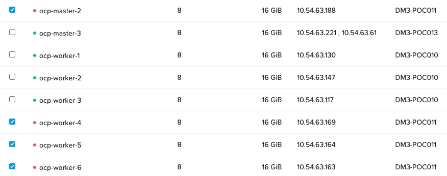

import Tabs from '@theme/Tabs';
import TabItem from '@theme/TabItem';

# Overview

In this section we will install a mutli-zone deployable workload. The workload will contain the following component:

- Back-end database - Crunchy Postgres SQL Database


## Install Crunchy Postgres Operator

1. Download the crunchy data manifests
   ```bash
   git clone https://github.com/CrunchyData/postgres-operator-examples
   ```
2. Install the operator
   ```bash
   oc apply -k kustomize/install/namespace
   oc apply --server-side -k kustomize/install/default
   ```
3. Check status of operator
   ```bash 
   oc get po
   ```
   ```bash title="Output"
   NAME                           READY   STATUS      RESTARTS   AGE
   pgo-79dd9d544d-sd9dp           1/1     Running     0          38m
   pgo-upgrade-6bdd468d8d-wmjg8   1/1     Running     0          38m
   ```

## Install Crunchy Postgres Database

1. Create a new postgres database manifest with the following attributes:
   
   
   - Using ``3`` replicas for the Deployment - as we have three availability zones
   - Using a topology key provided by Nutanix ``csi.nutanix.com/prism-element-uuid`` 
   - Using strict topology maintenance requirement ``requiredDuringSchedulingIgnoredDuringExecution``
  
  
   ```bash showLineNumbers title="Create this manifest"
   cat << EOF > zoo.yaml 
   apiVersion: postgres-operator.crunchydata.com/v1beta1
   kind: PostgresCluster
   metadata:
     name: hippo
   spec:
     image: registry.developers.crunchydata.com/crunchydata/crunchy-postgres:ubi8-14.6-2
     postgresVersion: 14
     instances:
       - name: ha-instance
         replicas: 3                                             ## << Three replicas for three AZs
         dataVolumeClaimSpec:
           accessModes:
           - "ReadWriteOnce"
           resources:
             requests:
               storage: 1Gi
         affinity:
           podAntiAffinity:
             requiredDuringSchedulingIgnoredDuringExecution:     ## << Following strict scheduling in each zone
             - topologyKey: csi.nutanix.com/prism-element-uuid   ## << Nutanix provided topology key
               labelSelector:
                 matchLabels:
                   postgres-operator.crunchydata.com/cluster: hippo
                   postgres-operator.crunchydata.com/instance-set: ha-instance
     users:
     - name: rhino
       databases:
         - zoo
       options: "NOSUPERUSER"
     backups:
       pgbackrest:
         image: registry.developers.crunchydata.com/crunchydata/crunchy-pgbackrest:ubi8-2.41-2
         repos:
         - name: repo1
           volume:
             volumeClaimSpec:
               accessModes:
               - "ReadWriteOnce"
               resources:
                 requests:
                   storage: 1G        
   EOF
   ```
2. Apply the manifest to create database pods, database and user
   
   ```bash
   oc apply -f zoo.yaml
   ```
   
3. Watch the pods as they come up 
  
   ```bash
   oc get po -w --output custom-columns=NAME:metadata.name,IP:status.podIP,NODE:spec.nodeName,STATUS:status.phase
   ```
   ```bash title="Output"
   NAME                           IP             NODE           STATUS
   hippo-backup-z9c8-6fd72        10.129.4.218   ocp-worker-6   Succeeded
   hippo-ha-instance-59xc-0       10.130.4.21    ocp-worker-7   Running   # << AZ 3
   hippo-ha-instance-9248-0       10.131.0.11    ocp-worker-4   Running   # << AZ 2
   hippo-ha-instance-xdhf-0       10.130.0.12    ocp-worker-1   Running   # << AZ 1
   hippo-repo-host-0              10.128.4.23    ocp-worker-5   Running
   pgo-79dd9d544d-rrt8j           10.130.2.12    ocp-worker-3   Running
   pgo-upgrade-6bdd468d8d-wmjg8   10.130.4.9     ocp-worker-7   Running
   ```

   There is a copy of the database instance running in each AZ 

  1. Check the endpoints to see which of the pods is the primary copy - match the IP address of the pod to the endpoint IP. This will be your masterpod.

     ```bash
     oc get ep
     ```
     ```bash title="Output"
     NAME              ENDPOINTS                                         AGE
     hippo-ha          10.131.0.11:5432                                  17m ## << HA Endpoint is pointing to AZ 2
     hippo-ha-config   <none>                                            17m
     hippo-pods        10.128.4.23,10.130.0.12,10.130.4.21 + 1 more...   18m
     hippo-primary     172.30.5.231:5432                                 18m
     hippo-replicas    10.130.0.12:5432,10.130.4.21:5432                 18m
     ```

  2. Here the master pod corresponding to the ``hippo-ha`` endpoint is ``hippo-ha-instance-9248-0`` with IP ``10.131.0.11``
    
    :::note

    These will be different for you:

     - Endpoint IP
     - Pod IP
     - Pod name 
     - AZ for your master pod - in this example the master pod is in AZ 2
  
    :::

  3. Now let us take a look at the storage side of things (physical volume claims). You can notice the following:

      - All three database pods have 1 Gi of storage allocated to it 
      - The pvc are provisioned using CSI named  ``nutanix-volume`` 
      - All these pvc are volume groups 
 
     ```bash
     oc get pvc
     NAME                            STATUS   VOLUME                                     CAPACITY   ACCESS MODES   STORAGECLASS     AGE
     hippo-ha-instance-59xc-pgdata   Bound    pvc-3ff9f16c-b129-44da-baa9-0db6a32bc2bc   1Gi        RWO            nutanix-volume   3h27m
     hippo-ha-instance-9248-pgdata   Bound    pvc-40e5bdf2-b434-4b86-b06f-b7ea726ff2cb   1Gi        RWO            nutanix-volume   3h27m
     hippo-ha-instance-xdhf-pgdata   Bound    pvc-80d6c7a3-70cf-48da-aa47-8c7442b18d06   1Gi        RWO            nutanix-volume   3h27m
     hippo-repo1                     Bound    pvc-3a2ff122-0706-43e0-9802-1bb734218460   1Gi        RWO            nutanix-volume   3h27m
     ```

     <details>

     <summary>Where are my PVCs located?</summary>
     You can also verify the physical location of these pvc in Prism Central 
     
     - Go to Prism Central 
     - In the Search window; type volume groups
     - In the filters; select the NAME and type pvc- (as shown in the image)
     - You should see the volume groups and the AZ (cluster) location

     
   
    
     </details>
     
### Connect to the Database

We can now connect to the database and populate it with sample data.

  1. Connect to the master copy of the database
     
     ```bash
     oc exec -it -n postgres-operator -c database <masterpodname>  -- psql zoo
     ```

     ```bash title="Sample command using the master pod name - you will see the sql prompt"
     oc exec -it -n postgres-operator -c database hippo-ha-instance-9248-0  -- psql zoo
     psql (14.6)
     Type "help" for help.
     
     zoo=#
     ```
    
  5. Inside the database prompt (zoo=# ), create a table and populate some data
   
     ```sql
     CREATE TABLE animals (
       id serial PRIMARY KEY,
       name text NOT NULL,
       species text NOT NULL,
       gender text NOT NULL,
       weight real NOT NULL,
       date_of_birth date NOT NULL,
       location text NOT NULL
     );
     ```


  6. Insert some sample data into this
     
     ```sql
     INSERT INTO animals (name, species, gender, weight, date_of_birth, location)
     VALUES ('Lion King', 'Lion', 'Male', 200.0, '2010-01-01', 'Savanna Exhibit'),
            ('Queenie', 'Elephant', 'Female', 1500.0, '2008-05-05', 'Jungle Exhibit'),
            ('Rio', 'Parrot', 'Male', 0.5, '2011-12-12', 'Rainforest Exhibit');
     ```

  7. Check if the table has values
    
    ```sql
    SELECT * FROM animals;
    ```
  
    ```sql title="Output"
    id |   name    | species  | gender | weight | date_of_birth |      location
   ----+-----------+----------+--------+--------+---------------+--------------------
     1 | Lion King | Lion     | Male   |    200 | 2010-01-01    | Savanna Exhibit
     2 | Queenie   | Elephant | Female |   1500 | 2008-05-05    | Jungle Exhibit
     3 | Rio       | Parrot   | Male   |    0.5 | 2011-12-12    | Rainforest Exhibit
    (3 rows)
     ```
### Simulate AZ Failure 

  1. Simulate a AZ failure by shutting down all the OCP nodes in AZ 2
  
  2.  In Prism Central, go to Menu > Compute & Storage > VMs
   
  3.  Select all the AZ 2 OCP VMs (this could be a different AZ for you)
   
      - ocp-master2
      - ocp-worker4
      - ocp-worker5
      - ocp-worker6
  
  4.  Click on **Actions** > **Guest shutdown**

  5.  Confirm all AZ 2 OCP VMs are shutdown (there would be a red dot in front of the name of the VM)
     

   

  9. Return to you command-line to check the status of pods and endpoints

     ```bash
     oc get ep,po -o wide
     ```
     ```bash title="Output - observe the details of the endpoint to the primary copy"
     $ oc get ep -w
     oc get ep -w
     NAME              ENDPOINTS                                         AGE
     hippo-ha          10.130.4.11:5432                                  3h4m
     hippo-ha-config   <none>                                            3h4m
     hippo-pods        10.128.4.23,10.130.0.12,10.130.4.21 + 1 more...   3h5m
     hippo-primary     172.30.5.231:5432                                 3h5m
     hippo-replicas    10.130.0.12:5432                                  3h5m
     hippo-ha          10.130.4.11:5432                                  3h5m
     hippo-ha          10.130.4.11:5432                                  3h5m
     hippo-ha          <none>                                            3h5m  # Endpoint is re-assigning IP
     hippo-ha          10.130.4.21:5432                                  3h5m  # Endpoint has a new IP
     ```
     :::note
     The change to the endpoint IP address should happen within a few seconds as Kubernetes re-assigns the IP of the primary copy of the database pod to a different one.
     :::

     Eventually the pod will transition to `Terminating` state (between 5 and 8 minutes). This is irrelevant to application availability as our endpoint in already pointing to a different pod in AZ3

10.  Check the status of the pods 

     ```bash
     oc get po --output custom-columns=NAME:metadata.name,IP:status.podIP,NODE:spec.nodeName,STATUS:status.phase
     ```
     ```bash title="Output - observe the details of the database primary copy"
     NAME                           IP             NODE           STATUS
     hippo-backup-z9c8-6fd72        10.129.4.218   ocp-worker-6   Succeeded
     hippo-ha-instance-59xc-0       10.130.4.21    ocp-worker-7   Running      # Primary database pod is now in AZ 3
     hippo-ha-instance-9248-0       10.131.0.11    ocp-worker-4   Terminating  # This was the previous Primary copy in AZ 2
     hippo-ha-instance-xdhf-0       10.130.0.12    ocp-worker-1   Running
     hippo-repo-host-0              10.128.4.23    ocp-worker-5   Running
     pgo-79dd9d544d-rrt8j           10.130.2.12    ocp-worker-3   Running
     pgo-upgrade-6bdd468d8d-wmjg8   10.130.4.9     ocp-worker-7   Running
     ```

11. Now let's login to the new master pod and check if data exists
    
    ```bash 
    oc exec -it -n postgres-operator -c database hippo-ha-instance-59xc-0  -- psql zoo
    ```

12. In the psql prompt, run the select statement for our table
    
    ```sql
    SELECT * FROM animals;
    ```
  
    ```sql title="Output"
    id |   name    | species  | gender | weight | date_of_birth |      location
   ----+-----------+----------+--------+--------+---------------+--------------------
     1 | Lion King | Lion     | Male   |    200 | 2010-01-01    | Savanna Exhibit
     2 | Queenie   | Elephant | Female |   1500 | 2008-05-05    | Jungle Exhibit
     3 | Rio       | Parrot   | Male   |    0.5 | 2011-12-12    | Rainforest Exhibit
    (3 rows)
    ```

    This proves that the database has replicated to a different zone (AZ 3 in our case) and continued to provide application availability.
    
  <details>

  <summary>Optional step - Check Postgres database replication status</summary>
  You can also check whether the current database is the master by running the following command in the psql prompt.

  ```sql
  select pg_is_in_recovery();
  ```
  ```sql title="Output sample"
  zoo=# select pg_is_in_recovery();
   pg_is_in_recovery
  -------------------
   f
  (1 row)

  # 'f' meaning false, which is an indication of the primary replica of the database
  ```
  </details>
  
## Takeaways

- Nutanix is able to provide topology features to kubernetes based workloads
- Currently ``csi.nutanix.com/prism-element-uuid`` is available for OCP. In future we will bring more topology keys integrating [CCM](https://kubernetes.io/docs/concepts/architecture/cloud-controller/)
- Nutanix is bridging the gap between infrastructure and Kubernetes 
  - Allowing DevOps engineers seamlessly use infrastructure constructs ``topologyKey`` in their Infrastructure as Code (IaaC) 
  - Infrastructure engineers can now easily learn and use Infrastructure as Code (IaaC) 
  - Infrastructure engineers can now concentrate on capacity planning and other important projects
